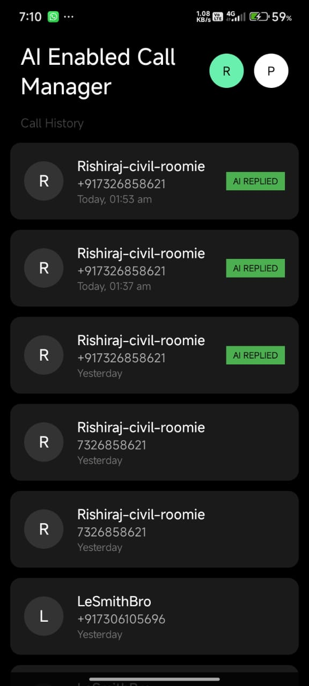

#  AI Powered Call Management App(FORMALHAULT)
> **Autonomous Call Management & Context-Aware Response System**

**FORMALHAULT** is a native Android application designed to intelligently handle phone interruptions. Unlike standard auto-responders, it utilizes a forensic approach to **Android Telephony States** and **System Databases** to accurately distinguish between "Missed", "Rejected", and "Answered" calls—solving the "False Positive" problem caused by apps like Truecaller.

-orange?style=for-the-badge&logo=java)
-green?style=for-the-badge&logo=android)


---

##  Interface (Dark Mode "Hacker" UI)

| **Dashboard** | **Boss Report** | **Protocol Config** |
|:---:|:---:|:---:|
|  |  |  |

> *Clean, minimalist "Dark Mode" interface designed for high readability and low battery consumption.*

---

##  The Engineering Problem
Standard Android `TelephonyManager` listeners (`READ_PHONE_STATE`) are unreliable in modern ecosystems because:
1.  **App Interference:** Apps like **Truecaller** or Voicemail services momentarily trigger an `OFFHOOK` (Answered) state to identify spam, even if the user never picked up.
2.  **Aggressive Battery Optimization:** OEMs like Xiaomi (HyperOS) kill background services immediately after a call ends, preventing auto-reply logic from executing.

##  The FORMALHAULT Solution
Shakthi AI bypasses these limitations using a **Forensic State Verification** architecture:

### 1. Asynchronous Database Verification
Instead of trusting the real-time "Phone State," Shakthi waits for the connection to go `IDLE` and then performs a **System Database Query** on the native `CallLog` provider.
* **Logic:** It verifies the final `type` of the last call entry (`MISSED_TYPE` vs `INCOMING_TYPE`).
* **Result:** Zero false positives. It never spams people you actually spoke to.

### 2. "Always-On" Receiver Architecture
* Replaced heavy background Services with a lightweight `BroadcastReceiver`.
* Utilizes `goAsync()` to keep the process alive just long enough (1500ms) to perform the database verification and dispatch the SMS, ensuring reliability even if the app is swiped away from memory.

### 3. Event-Based Logging
* The "Boss Report" dashboard doesn't just show call history; it filters logs based on **Timestamp Fingerprinting**.
* Only calls that triggered a specific AI logic execution are displayed in the Report view.

---

## 🛠️ Tech Stack
* **Language:** Java (Native Android)
* **Core APIs:**
    * `TelephonyManager` (State Detection)
    * `ContentResolver` & `Cursor` (Database Forensics)
    * `BroadcastReceiver` (Event Listening)
    * `SmsManager` (Payload Dispatch)
    * `SharedPreferences` (Event Fingerprinting)
* **UI Components:** `RecyclerView`, `CardView`, Custom XML Drawables.

---

## ⚙️ Installation & Setup
1.  Clone the repository:
    ```bash
    git clone [https://github.com/YOUR_USERNAME/Shakthi-AI.git](https://github.com/YOUR_USERNAME/Shakthi-AI.git)
    ```
2.  Open in **Android Studio**.
3.  Build and Run on a physical device (Emulator cannot simulate SMS/Call Logs accurately).
4.  **Permissions Required:**
    * Call Logs (To verify missed status)
    * Phone State (To detect incoming calls)
    * Send SMS (To reply)
5.  **For Xiaomi/Oppo/Vivo Users:** Enable "Autostart" in App Info settings to allow background execution.

---

## 🔮 Future Roadmap
* [ ] **"God Mode" Dialer:** Replacing the default System Phone app with a custom `InCallService` UI.
* [ ] **LLM Integration:** Using on-device Gemini Nano to generate context-aware replies based on calendar events.
* [ ] **Voice-to-Text:** Converting voicemail audio into text summaries for the "Boss Report."

---

## 👨‍💻 Author
**Arvind (AKN)**
* *2nd Year B.Tech Computer Science, NIT Calicut*
* *Passionate about AI, System Engineering, and Spiritual Tech.*

**"Made with logic, powered by Patience"** 
